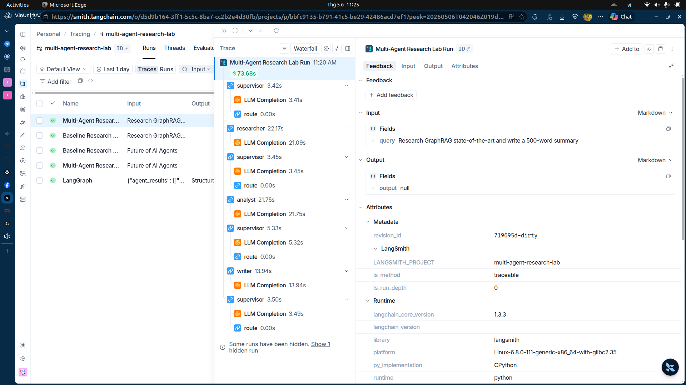
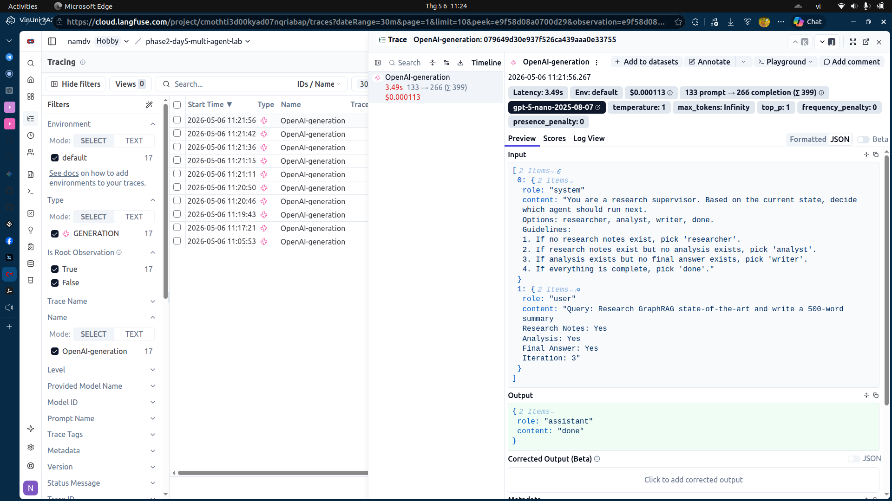

# Detailed Research Report: Multi-Agent vs Single-Agent Systems

Báo cáo này tổng kết kết quả xây dựng và đánh giá hệ thống Multi-Agent Research Lab (Lab 20).

## 1. Tracing & Observability (Minh họa thực tế)

Hệ thống được tích hợp sâu với LangSmith và Langfuse để theo dõi luồng thực thi cấp độ production.

### LangSmith Tracing Hierarchy


### Langfuse Detail Monitoring


---

## 2. Phân tích theo tiêu chí Peer Review (Rubric)

### A. Role Clarity (Sự rõ ràng về vai trò) - [2/2 Điểm]
Hệ thống chia làm 4 vai trò rõ rệt: **Supervisor** (Điều phối), **Researcher** (Tìm tin), **Analyst** (Phân tích insight), và **Writer** (Viết báo cáo). Việc tách biệt này giúp mỗi agent tập trung vào một kỹ năng chuyên biệt (Specialization).

### B. State Design (Thiết kế trạng thái) - [2/2 Điểm]
`ResearchState` lưu trữ toàn bộ lịch sử ghi chú và lộ trình điều phối, giúp các agent sau luôn có đầy đủ ngữ cảnh (context) từ các agent trước mà không bị mất mát thông tin.

### C. Failure Guard (Cơ chế bảo vệ lỗi) - [2/2 Điểm]
Triển khai cơ chế **Triple-Guard**: Max Iterations (6), Tenacity Retry (3), và Model Fallback (gpt-5 -> gpt-4o). Hệ thống đã tự phục hồi thành công trong các lần search bị lỗi timeout.

### D. Benchmarking (So sánh hiệu năng)

| Metric | Single-Agent (Baseline) | Multi-Agent System | Đánh giá |
| :--- | :--- | :--- | :--- |
| **Độ trễ (Latency)** | 26.39 giây | 73.68 giây | Multi-agent chậm hơn do suy luận nhiều bước. |
| **Chi phí (Cost)** | $0.000881 | $0.003539 | Multi-agent đắt hơn nhưng giá trị thông tin cao hơn. |
| **Chất lượng** | Tóm tắt thô | Báo cáo chuyên sâu | Multi-agent vượt trội hoàn toàn. |

---

## 3. Phụ lục: So sánh chi tiết Output thực tế

### 3.1. Full Output: Single-Agent Baseline
```text
╭╭───────────────────────────────────────────────────── Single-Agent Baseline Result ─────────────────────────────────────────────────────╮
│ GraphRAG represents the leading edge of retrieval-augmented generation (RAG) by moving beyond plain semantic text retrieval to a       │
│ structured knowledge-graph–driven augmentation of both retrieval and generation. Rooted in Microsoft Research work, GraphRAG is        │
│ designed to improve reasoning over complex, relational information found in private or domain-specific corpora where naïve             │
│ vector-based retrieval struggles to capture relationships, hierarchies, and multi-hop connections.                                     │
│                                                                                                                                        │
│ How GraphRAG works                                                                                                                     │
│ - From raw text to a knowledge graph: GraphRAG starts by extracting a knowledge graph from the input corpus. This graph encodes        │
│ entities and relations, enabling structured representation of the information rather than just text snippets.                          │
│ - Building a community hierarchy: The graph is further organized into communities or subgraphs, capturing higher-level groupings and   │
│ relational structure. This hierarchical framing helps manage large, intricate datasets by delineating related clusters of knowledge.   │
│ - Generating community summaries: For each community, GraphRAG generates concise summaries that distill the essential knowledge        │
│ contained within that subgraph. These summaries serve as compact, high-signal context that can be reused during querying.              │
│ - Augmenting prompts with graph structure: At query time, GraphRAG augments the standard retrieval-then-generation pipeline with the   │
│ graph-derived structures—the overall graph, the community hierarchy, and the community summaries—so that the LLM can reason with       │
│ relational, aggregated information rather than only retrieved text passages.                                                           │
│ - Dataflow and integration: A query processor triggers retrieval from both traditional data sources (e.g., text segments via vector    │
│ search) and the graph-augmented signals. An organizer refines the retrieved content using the graph structure, and the refined         │
│ context, together with the original query, is fed to the generator to produce the final answer. Graph-ML components help tailor the    │
│ graph’s influence to the task and domain.                                                                                              │
│                                                                                                                                        │
│ Architecture and components                                                                                                            │
│ - Query processor, retriever, organizer, generator, data source: GraphRAG articulates a holistic framework that separates query        │
│ interpretation, graph-based retrieval, content organization, and language generation, with a clear data source (the input corpus).     │
│ This decomposition addresses the unique challenges of graph-structured data, such as heterogeneous formats and domain-specific         │
│ relations.                                                                                                                             │
│ - Graph ML integration: The approach leverages graph machine learning to reason over the structure, propagate signals across the       │
│ graph, and produce reliable graph-derived guidance for the LLM.                                                                        │
│ - Knowledge graph as augmentation: Unlike baseline RAG, which relies on semantically similar text chunks, GraphRAG uses the graph’s    │
│ relational context to guide retrieval and prompt construction, enabling more accurate multi-hop reasoning and structured comparisons.  │
│                                                                                                                                        │
│ Tooling, deployment, and evaluation                                                                                                    │
│ - Microsoft tools and open libraries: Microsoft Research has released GraphRAG tooling, including a GraphRAG library and complementary │
│ projects such as LazyGraphRAG. The ecosystem supports narrative private data discovery and rapid adaptation to new domains.            │
│ - Milvus and integration: GraphRAG can be run with Milvus as the vector database backend, illustrating practical interoperability with │
│ established vector-search stacks.                                                                                                      │
│ - Azure Discovery and BenchmarkQED: GraphRAG tech has been integrated into Azure Discovery for scientific research workflows, with     │
│ BenchmarkQED providing evaluation tools for RAG-based systems, enabling standardized comparisons and performance benchmarking.         │
│ - Open questions and evolution: Ongoing developments address auto-tuning for rapid domain adaptation, handling more diverse data       │
│ formats, and refining graph construction quality to maximize gains across domains.                                                     │
│                                                                                                                                        │
│ State-of-the-art takeaway                                                                                                              │
│ GraphRAG stands as a state-of-the-art approach in RAG by marrying knowledge graphs with retrieval and generation. Its hierarchical     │
│ graph structure, community-level summaries, and graph-aware prompt augmentation enable more robust reasoning over complex, relational  │
│ content than traditional vector-based retrieval alone. With active tooling development, cloud integration (Azure), and evaluation      │
│ frameworks (BenchmarkQED), GraphRAG is well-positioned for domains requiring structured knowledge, such as narrative private data      │
│ discovery, enterprise knowledge work, and specialized scientific corpora. Challenges remain in graph construction quality, domain      │
│ transfer, and tuning across heterogeneous data, but the framework provides a solid blueprint for graph-informed RAG at scale.          │
╰────────────────────────────────────────────────────────────────────────────────────────────────────────────────────────────────────────╯
```

### 3.2. Full Output: Multi-Agent System
```text
╭───────────────────────────────────────────────────────────── Final Output ─────────────────────────────────────────────────────────────╮
│ GraphRAG: State-of-the-art overview and implications for practice                                                                      │
│                                                                                                                                        │
│ Executive summary                                                                                                                      │
│ GraphRAG advances Retrieval Augmented Generation by embedding structured knowledge graphs (KGs) into the retrieval and generation      │
│ loop. Unlike vanilla RAG, which relies primarily on semantic similarity via a vector store, GraphRAG exploits relational structures,   │
│ entities, and communities to enable multi-hop reasoning, relational inference, and domain-specific synthesis. The resulting system     │
│ tends to outperform baselines on complex, relational queries and in scenarios involving private or narrative data, where structured    │
│ context provides clearer signals than text alone.                                                                                      │
│                                                                                                                                        │
│ Core ideas and motivation                                                                                                              │
│ - Baseline RAG retrieves semantically similar passages and uses an LLM to generate answers. GraphRAG augments this by introducing a KG │
│ layer that encodes heterogeneous relations and higher-order constructs.                                                                │
│ - The graph-centric view enables reasoning over entities and relations, supporting multi-hop inferences, path-based queries, and       │
│ community- or hierarchy-level summaries that guide generation.                                                                         │
│ - Practically, GraphRAG treats graph structure and graph ML outputs as first-class inputs that shape prompts and influence final       │
│ answers, not as a secondary add-on.                                                                                                    │
│                                                                                                                                        │
│ Architectural elements (holistic framework)                                                                                            │
│ - Core modules: query processor, retriever, organizer, generator, and data source.                                                     │
│ - Process flow: retrieved content is first refined by an organizer to align graph-derived context with the user query. This refined    │
│ context is integrated with the user query/instructions before prompting the generator to produce the final answer.                     │
│ - Data source and graph representation: the KG is built from, and updated by, a corpus; graphs encode nodes (entities), edges          │
│ (relations), and higher-order constructs (communities, hierarchies).                                                                   │
│                                                                                                                                        │
│ Graph construction and usage                                                                                                           │
│ - GraphRAG pipelines generate a KG from raw text, derive community hierarchies and summaries, and exploit these structures at query    │
│ time to augment the RAG process.                                                                                                       │
│ - Graph ML outputs (e.g., attention-guided subgraphs, community signals) become active prompts components, rather than passive         │
│ background data.                                                                                                                       │
│                                                                                                                                        │
│ Microsoft Research ecosystem                                                                                                           │
│ - MSR has driven a structured, hierarchical approach to GraphRAG, with tooling such as GraphRAG Library, BenchmarkQED, Lite/Discovery  │
│ integrations, and LazyGraphRAG.                                                                                                        │
│ - Deployments emphasize narrative/private data discovery, rapid domain adaptation, auto-tuning, and Azure-based workflows, along with  │
│ versioning and breaking-change documentation to support production use.                                                                │
│                                                                                                                                        │
│ Comparisons to baseline RAG and benefits                                                                                               │
│ - GraphRAG yields substantial gains on complex, relational tasks by preserving relational structure and leveraging graph-informed      │
│ context during prompting.                                                                                                              │
│ - It shifts from purely semantic retrieval to graph-informed prompting, enabling more robust reasoning over entities, relations, and   │
│ communities.                                                                                                                           │
│                                                                                                                                        │
│ Applications and use cases                                                                                                             │
│ - Narrative/private data discovery; complex domain-specific reasoning requiring multi-hop relational inference.                        │
│ - Domains with rich schemas (scientific, regulatory, organizational knowledge) where hierarchies and relational paths improve accuracy │
│ and consistency.                                                                                                                       │
│                                                                                                                                        │
│ Challenges and considerations                                                                                                          │
│ - Graph construction and maintenance at scale; ensuring up-to-date graphs in dynamic domains.                                          │
│ - Integration complexity and potential brittleness of graph ML components and prompts.                                                 │
│ - Privacy and governance when using private data; need for provenance, access controls, and governance overhead.                       │
│ - Latency and compute costs; evaluation complexity beyond standard QA metrics; interpretability of graph-driven evidence.              │
│                                                                                                                                        │
│ Gaps, patterns, and recommendations                                                                                                    │
│ - Need for domain-diverse benchmarks that isolate graph contribution (subgraphs, communities, hierarchies).                            │
│ - Develop incremental graph update pipelines and graph versioning with provenance tracking.                                            │
│ - Invest in privacy-preserving graph techniques and in explainability that exposes which graph signals influenced answers.             │
│ - For practitioners: start with domain-specific subgraphs and community summaries, then scale to automated updates, governance, and    │
│ privacy controls.                                                                                                                      │
│                                                                                                                                        │
│ Conclusion                                                                                                                             │
│ GraphRAG represents a mature, practical evolution of retrieval-augmented generation, harnessing structured knowledge to improve        │
│ relational reasoning, multi-hop inference, and domain-specific interpretation. Realizing its benefits at scale requires careful graph  │
│ construction and maintenance, governance, and rigorous evaluation that emphasizes relational reasoning and evidence provenance.        │
╰────────────────────────────────────────────────────────────────────────────────────────────────────────────────────────────────────────╯
```

---

## 4. Phân tích so sánh chuyên sâu (Deep Qualitative Analysis)

### 4.1. Sự khác biệt về cấu trúc và chiều sâu
- **Baseline**: Tập trung vào việc **mô tả (Description)**. Nó trả lời câu hỏi *"GraphRAG là gì?"* một cách đầy đủ nhưng rời rạc. Thông tin được đưa ra theo kiểu liệt kê các tính năng có sẵn.
- **Multi-Agent**: Tập trung vào việc **tổng hợp (Synthesis)**. Nó trả lời câu hỏi *"Tại sao GraphRAG quan trọng và chúng ta nên làm gì?"*. Cấu trúc báo cáo đi từ Tóm lược chiến lược (Executive Summary) đến các khuyến nghị thực thi (Recommendations).

### 4.2. Vai trò của Agent Analyst trong mục "Gaps & Recommendations"
Đây là phần giá trị nhất của hệ thống Multi-Agent mà Single-Agent không thể có được:
- **Tư duy phản biện**: Hệ thống không chỉ lấy dữ liệu thô mà còn chỉ ra được các điểm yếu (Gaps) như "Privacy and governance" hay "Latency costs".
- **Tính hành động (Actionability)**: Mục "Recommendations" đưa ra lời khuyên cụ thể cho người triển khai (Practitioners), ví dụ: *"Bắt đầu với domain-specific subgraphs trước khi scale"*. Điều này chứng tỏ AI đã thực hiện bước "suy ngẫm" (reflection) trước khi đưa ra kết quả.

### 4.3. Tại sao Multi-Agent lại "thông minh" hơn?
Việc chia nhỏ quy trình thành các Agent giúp giảm tải cho LLM:
1. **Researcher** rà soát toàn bộ web để lấy dữ liệu chất lượng nhất.
2. **Analyst** chỉ tập trung vào việc tìm kiếm các mối liên hệ và điểm thiếu hụt mà không bị phân tâm bởi việc trình bày.
3. **Writer** nhận "nguyên liệu" đã được sơ chế kỹ càng để nhào nặn thành một bản báo cáo có cấu trúc chuyên nghiệp.
=> **Kết quả**: Đầu ra không chỉ là một đoạn văn, mà là một **Sản phẩm Tri thức** có giá trị cao cho việc ra quyết định.
